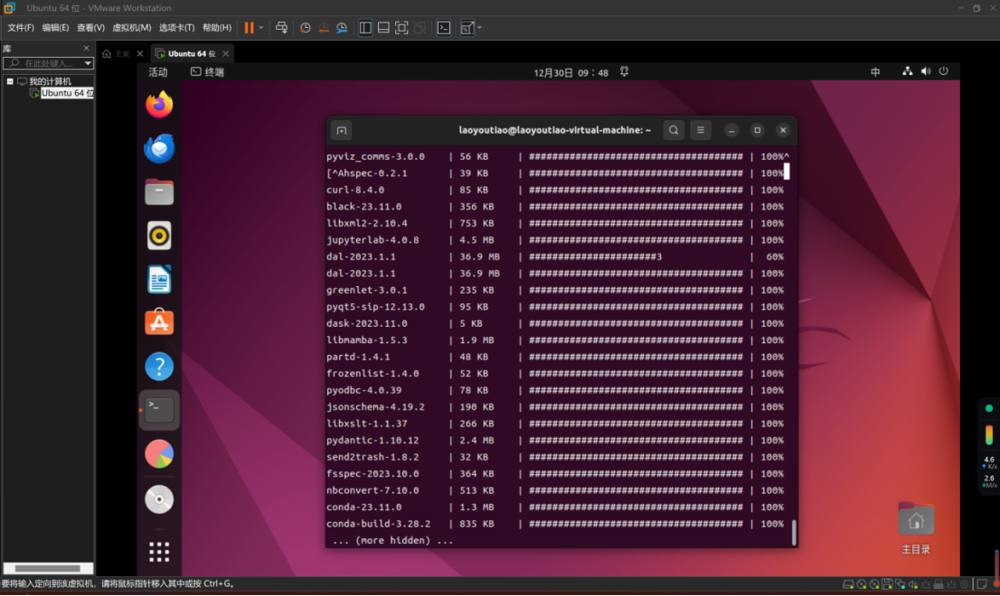
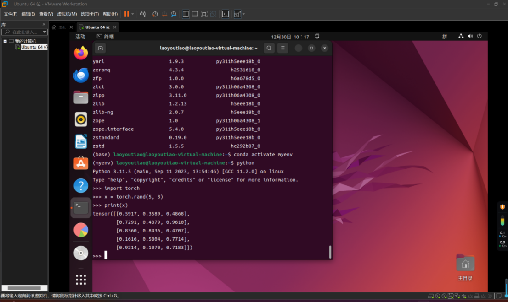
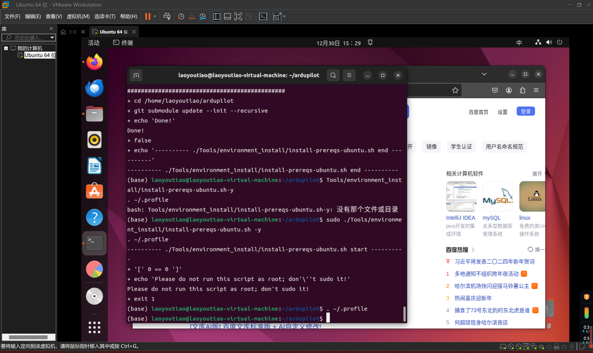
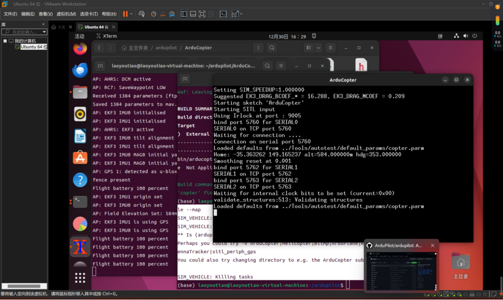
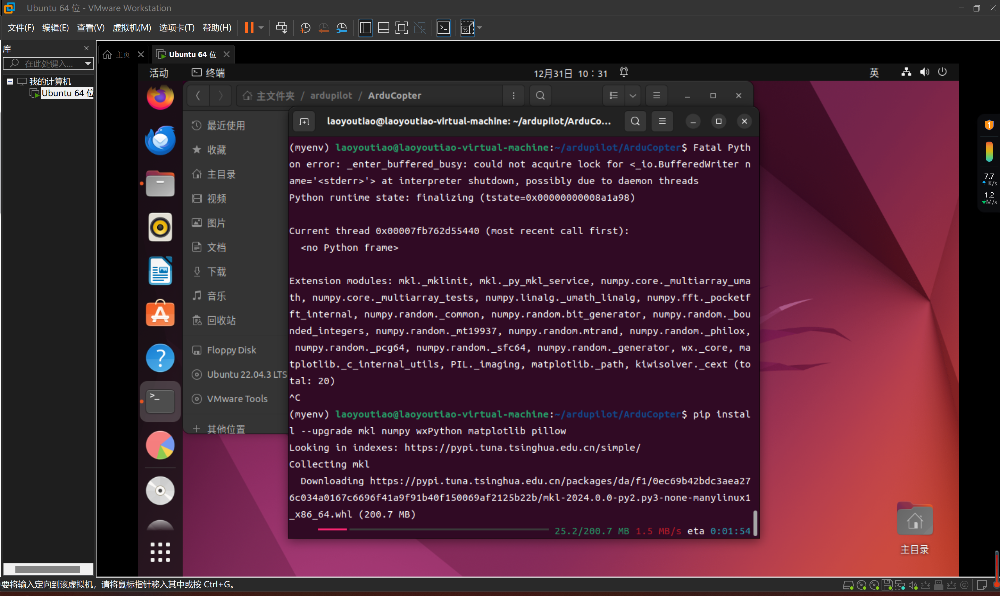

###零、在vscode里写markdown
:smile::smile::smile::smile::smile:  
####1、安装markdown  
markdown可在vscode中作为插件安装使用  
先下载vscode，然后在插件商店安装即可  
在文件夹中新建.md格式文件  
安装配套插件：Markdown All in One、Markdown Preview   Ehanced、Paste Image  
安装完成后，重启vscode使插件生效  
Ctrl+，（逗号）=打开setting，进入设置界面  
搜索break，取消勾选Break on single new line，避免不必要的空格  
完成编辑md文件后，右键点击预览（preview），查看效果  
顺带一提，ctrl+b在vscode中打开或关闭左边文件栏  
####2、常规markdown使用  
标题###   行末两个空格换行  
emoji:xxx::blush::smirk::kissing::heart_eyes:  
嵌入代码
```c
 #include<stdio.h>
 ```  
插入图片，是需要简单的复制粘贴就好，markdown会自动在同一个文件夹下备份存入的图片  
如果忘记保存，在左侧文件栏底下的时间线里可以找回数据  


###一、使用虚拟机安装Ubuntu系统
####1、选择虚拟机安装Ubuntu系统  
安装Vmware虚拟机最好划分一片专门的磁盘区域  
在镜像网站下载ubuntu系统文件  
在虚拟机内安装ubuntu  
:x:安装ubuntu时有警告说会删除磁盘内所有文件，我觉得应该早分一个磁盘区域  
但是后来发现它所说的删除磁盘文件指的是虚拟机的而不是主机的  
直接安装:laughing:  :o:
####2、换源,换输入法  
安装完成后需要换服务源，默认的不能用  
在软件更新器中安装选择最佳服务源  
ctrl+alt+T打开命令行输入指令 sudo apt upgrade更新软件  
:x:输入密码时不显示（我还以为出什么问题了）:o:  （指令clear清空）  
安装软件中心
```
sudo apt install pla  
```
```
sudo apt install plasma-discover  
```
安装中文输入法
```
sudo apt install ibus-sunpinyin
```  
:x:我的Ubuntu右上角没有语言栏:dizzy_face:  
在设置里键盘找到输入源添加  
实现可以在命令行中打中文，但是在浏览器里打不出来:dizzy_face:  
重启一下虚拟机就可以了(遇事不决重启一下):sweat::o:  


###二、打印“Hello，World”
####1、下载vscode，配置C++环境  
安装vscode，没什么好说的  
输入指令sudo apt-get install vim安装vim  
sudo apt install g++安装g++  
安装汉化、C\C++插件  
####2、写自定义的hello_world头文件  
:x:但是因为一开始误选了gcc运行时出错了  
在右上角点击齿轮图案重新选择调试配置  
选择g++生成和调试文件:o:  
:heart:main()
```cpp
#include<iostream>
#include"hello.h"
int main(){
    printfhello();
    return 0;
}  
```
:purple_heart:hello.h头文件
```cpp
#include<iostream>
#ifndef HELLOWORLD_H
#define HELLOWORLD_H
void printfhello(){
    printf("Hello,World!\n");
}
#endif
```


###三、编写代码调用摄像头
####1、安装OpenCV  
#####使用包管理器安装OpenCV
安装编译工具
```
sudo apt-get install build-essential 
``` 
安装从cmake,git,pkg-config辅助工具
```
sudo apt-get install cmake git pkg-config libgtk2.0-dev libavcodec-dev libavformat-dev libswscale-dev  
sudo apt-get install cmake  
sudo apt-get update  
sudo apt-get install libopencv-dev  
```
安装关联库
```
sudo apt-get install python-dev python-opencv python-numpy libtbb2 libtbb-dev libjpeg-dev libpng-dev libtiff-dev libjasper-dev libdc1394-22-dev
```
:x:报错本人搞不定，打算手动安装源代码  
#####手动安装源代码
更新软件和软件源  
```
sudo apt-get update 
sudo apt-get upgrade 
```
安装依赖库  
```
sudo apt-get install build-essential libgtk2.0-dev libgtk-3-dev libavcodec-dev libavformat-dev libjpeg-dev libswscale-dev libtiff5-dev
```
下载OpenCV源代码,从官网上下载source文件  
将文件解压缩到Codes文件夹中，并重命名为opencv  
进入到下载好的opencv目录中，新建目录build并进入build目录  
```
cd opencv
mkdir build
cd build
```
编译debug模式opencv库文件  
```
cmake -D CMAKE_BUILD_TYPE=Debug -D OPENCV_GENERATE_PKGCONFIG=YES -D CMAKE_INSTALL_PREFIX=/usr/local/OpenCV/Debug -D WITH_FFMPEG=ON ..
```  
编译安装OpenCV，使用make编译  
```
make -j8
```
使用make安装  
```
sudo make install
```

:x:安装过程中出错了,报错设备上空间不够，但是我明明划了100GB的磁盘空间  

打开磁盘资源管理器，看一下是根文件夹不足，为什么主文件夹只有2.7GB  
下载安装gparted来进行磁盘管理  
```
sudo apt update
sudo apt install gparted
```
打开gparted
```
sudo gparted
```
通过gparted发现又80GB的空间未分配，尝试扩大主文件夹，报错  
```
unable to resize read-only file system /dev/sda3
The file system can not be realized while it is mounted read-only.
Either unmount the file system or remount it read-write
```
无法调整只读文件系统/dev/sda3的大小  
使用lsof命令来检查确认没有任何正在使用/dev/sda3文件系统的进程  
```
sudo lsof | grep /dev/sda3
```
使用umount命令来卸载/dev/sda3文件系统：
```
sudo umount /dev/sda3
```
使用mount命令将/dev/sda3文件系统重新挂载为读写模式
```
sudo mount -o remount,rw /dev/sda3
```
然后通过gparted扩大主文件夹  
成功了成功了成功了！:o::laughing::laughing::laughing:  


环境配置  
打开/etc/ld.so.conf  
```
sudo gedit /etc/ld.so.conf
```
在文件中加上一行  
```
include /usr/local/lib
```
加入缓存  
```
 sudo ldconfig
```
打开 /etc/bash.bashrc 文件  
```
sudo gedit /etc/bash.bashrc
```
末尾加上  
```
PKG_CONFIG_PATH=$PKG_CONFIG_PATH:/usr/local/lib/pkgconfig
export PKG_CONFIG_PATH
```
再输入命令  
```
source /etc/bash.bashrc
```
检验  
```
pkg-config opencv --modversion
```
会出现opencv的版本  
:x:但是报错:dizzy_face:  
```
Package opencv was not found in the pkg-config search path.
```
创建pkgconfig文件
```
cd /usr/local/lib
 
sudo mkdir pkgconfig
cd pkgconfig
sudo touch opencv.pc
sudo vim opencv.pc
```
进入vim模式插入代码   :qa! 不保存退出  :wq  保存退出
```
prefix=/usr/local
exec_prefix=${prefix}
includedir=${prefix}/include
libdir=${exec_prefix}/lib
 
Name: opencv
Description: The opencv library
Version:4.8.0
Cflags: -I${includedir}/opencv4
Libs: -L${libdir} -lopencv_shape -lopencv_stitching -lopencv_objdetect -lopencv_superres -lopencv_videostab -lopencv_calib3d -lopencv_features2d -lopencv_highgui -lopencv_videoio -lopencv_imgcodecs -lopencv_video -lopencv_photo -lopencv_ml -lopencv_imgproc -lopencv_flann  -lopencv_core
```
检验:o:  
```
pkg-config opencv --modversion
```
转到 opencv-4.5.2/sample/cpp/example_cmake 目录下，打开终端  
```
cmake .
make
./opencv_example
```
转到 opencv-4.5.2/sample/cpp/example_cmake 目录下，打开终端  
```
cmake .
make
./opencv_example
```
"Hello,OpenCV"安装成功:laughing:
:x:但是摄像头并没有打开  
```
Built with OpenCV 4.8.0
[ WARN:0@0.002] global cap_v4l.cpp:982 open VIDEOIO(V4L2:/dev/video0): can't open camera by index
[ERROR:0@0.002] global obsensor_uvc_stream_channel.cpp:156 getStreamChannelGroup Camera index out of range
No capture
```
我猜测是因为虚拟机并没有连接到主机的摄像头  
在虚拟机设置里将USB版本改到3.1  
然后在虚拟机右下角点击摄像头图标，连接  
再次转到 opencv-4.5.2/sample/cpp/example_cmake 目录下，打开终端  
```
cmake .
make
./opencv_example
```
成功调取摄像头:o::laughing:  


####2、编写调用摄像头代码
一开始的代码  
```cpp
#include <opencv2/opencv.hpp>
#include <iostream>

int main() {
    cv::VideoCapture cap(0); // 打开默认摄像头
    if (!cap.isOpened()) {
        std::cerr << "无法打开摄像头" << std::endl;
        return -1;
    }

    cv::Mat frame;
    while (true) {
        cap >> frame; // 从摄像头获取新的一帧
        cv::imshow("Camera", frame);
        if (cv::waitKey(30) >= 0) // 按任意键退出
            break;
    }

    cap.release(); // 释放摄像头
    cv::destroyAllWindows(); // 关闭所有窗口

    return 0;
}
```
:x:报错：
```
/usr/bin/g++ -fdiagnostics-color=always -g /home/laoyoutiao/Codes/camera/main.cpp -o /home/laoyoutiao/Codes/camera/main
/home/laoyoutiao/Codes/camera/main.cpp:1:10: fatal error: opencv2/opencv.hpp: 没有那个文件或目录
    1 | #include <opencv2/opencv.hpp>
      |          ^~~~~~~~~~~~~~~~~~~~
compilation terminated.
```  
OpenCV路径出错，找到正确的路径/usr/lib/x86_64-linux-gnu  
安装库文件一时半会搞不定，回到上一步试试从源代码安装  
好安装好源代码后  
:x:运行程序，报错  
```
 fatal error: opencv/opencv.hpp: 没有那个文件或目录
```
找不到文件Opencv2，应该是路径的问题  
在/usr/include/opencv4/opencv2找到opencv2文件  
然后在usr/include/中创建一个opencv2的文件链接命令如下：  
```
sudo ln -s /usr/include/opencv4/opencv2 /usr/include/
```
再次运行文件，之前的报错似乎解决了:o:  
:x:但是又有新的报错  
```
collect2: error: ld returned 1 exit status
```
链接器无法成功地将所有的目标文件和库文件连接成一个可执行文件  
我在usr/include和usr/local/include都复制了一份Opencv2  
需要链接OpenCV库以便在程序中使用相关函数和类  
编译你的程序，使用以下命令：  
```
g++ -o main main.cpp `pkg-config opencv --cflags --libs`
```
:x:报错
```
/usr/bin/ld: 找不到 -lopencv_shape: 没有那个文件或目录
/usr/bin/ld: 找不到 -lopencv_superres: 没有那个文件或目录
/usr/bin/ld: 找不到 -lopencv_videostab: 没有那个文件或目录
collect2: error: ld returned 1 exit status
```
尝试使用另一个版本的 OpenCV,下面使用以下命令安装 OpenCV 4.5.3：  
```
sudo apt-get install libopencv-dev=4.5.3-4
```
然后，使用以下命令编译程序：  
```
g++ -fdiagnostics-color=always -g /home/laoyoutiao/Codes/camera/main.cpp -o /home/laoyoutiao/Codes/camera/main `pkg-config --cflags --libs opencv4`
```
运行程序  
```
./main
```
成功！！！！！！！！！！:o::grin::grin::grin:  


###四、将代码上传到github上  
####1、新建github仓库  
没什么可说的
####2、连接本地Git仓库和Github仓库
生成密钥
先创建SSH KEY，先看一下你C盘用户目录下有没有.ssh目录，有的话看下里面有没有id_rsa和id_rsa.pub这两个文件，有就跳到下一步，没有就通过下面命令创建
```
$ ssh-keygen -t rsa -C "youremail@example.com"
```
一直点击Enter进行确认，生成成功后，查看密钥文件，密钥保存在根目录下的 .ssh 文件夹下（默认是隐藏的），可使用Ctrl + H 查看到 ./ssh文件夹，或者直接 cd ./ssh，注意是查看 .pub文件，点击 id_rsa.pub文件，Ctrl + A,Ctrl + C，将文件里的内容全部复制到 github 上的ssh处，进入GitHub后，点击头像的展开的settings
新建文件夹，输入命令  
```
git init
```
建好仓库后，需要将仓库克隆到本地，点击仓库的code，复制HTTPS下方的URL:
```
git clone 仓库地址
```

####3、将本地代码推送到github上  
输入命令  
```
git add .
```
把这个文件夹下的目录的全部文件文件添加到缓存区  
查看现在的提交状态  
```
git status
```
把文件提交到本地仓库  
```
git commit -m "这里面写你的注释"  
```

由于本地Git仓库和Github仓库之间的传输是通过SSH加密的，所以连接时需要设置一下：  
格式
```
$ git remote add origin git@github.com:用户名/仓库名.git
```
```
$ git remote add origin git@github.com:YuanJieMaster/Invoke-the-camera.git
```
推送代码
```
git push origin main
```
github仓库的默认分支名是main，而较老版本的git在本地仓库默认的分支名是master，所以之前会出现上传后github上多了一个master的分支，如果想改成一致，可以使用如下命令：  
```
git branch -m master main
```
使用这个命令时需保证远程github仓库时没有本地提交的分支，如果提交main，而github上又设置选了README就会失败，:x:报错：  
```
error: failed to push some refs to 'github.com:YuanJieMaster/Invoke-the-camera.git'
```
此时可以使用以下命令将远程仓库中的更改合并到你的本地仓库中
```
git pull origin main
```
之后再使用push命令:o:  


###五、安装anaconda，配置pytorch环境

####1、安装anaconda
在镜像网站下载anaconda  
运行 Anaconda 安装脚本:
```
bash Anaconda3-2023.09-0-Linux-x86_64.sh
```
在Anaconda中，使用conda命令创建名为"myenv"虚拟环境
```
conda create --name myenv
```
激活虚拟环境：
```
conda activate myenv
```
在虚拟环境中安装第三方库：
```
conda install package_name
```
退出虚拟环境：
```
conda deactivate
```


####2、配置PyTorch环境
使用conda命令安装PyTorch。如果电脑有独立显卡，可以安装PyTorch的GPU版本。如果没有独立显卡，可以安装CPU版本或者使用云服务器。  
安装PyTorch库、TorchVision和TorchAudio库
安装PyTorch GPU版本：
```
conda install pytorch torchvision torchaudio cudatoolkit=xx.x -c pytorch
```
cudatoolkit=xx.x,这是指定PyTorch安装的CUDA工具包的版本，其中xx.x应该替换为系统上安装的CUDA版本。
安装PyTorch CPU版本,即不使用GPU加速：
```
conda install pytorch torchvision torchaudio cpuonly -c pytorch
```

确保PyTorch已成功安装在您的环境中:
```
conda list
```
要创建一个新的名为“myenv”的conda环境，可以使用以下命令：
```
conda create --name myenv
```
可以使用以下命令列出已有的conda环境：
```
conda env list
```
然后激活您想要使用的环境：
```
conda activate myenv
```
接下来验证PyTorch是否安装成功  
打开python：
```
python
```
在Python中输入：  
```
import torch
```
如果没有报错，则安装成功。
测试PyTorch： 安装完成后，可以使用以下代码测试PyTorch是否正常工作：
```
import torch
x = torch.rand(5, 3)
print(x)
```
如果您看到一个5x3的随机矩阵，则说明PyTorch已经成功安装并配置好。  


另外可以选择使用免费的云服务器服务，比如Google Colab，来学习和使用PyTorch  


###六、搭建SITL仿真环境，启动窗口
####1、搭建Ardupilot开发环境
安装git：
```
sudo apt-get update

sudo apt-get install git

sudo apt-get install gitk git-gui
```
然后输入以下命令：
```
git clone https://github.com/ArduPilot/ardupilot
cd ardupilot
git submodule update --init --recursive
```
接着运行对应的sh执行脚本开始安装所需的各种依赖包:
```
./Tools/environment_install/install-prereqs-ubuntu.sh -y
```
之后就需要配置路径
```
. ~/.profile
```
:x:大体上都很顺利，有一处小报错，不知道有什么隐患：
```
ERROR: pip's dependency resolver does not currently take into account all the packages that are installed. This behaviour is the source of the following dependency conflicts.
conda-repo-cli 1.0.75 requires requests_mock, which is not installed.
conda-repo-cli 1.0.75 requires clyent==1.2.1, but you have clyent 1.2.2 which is incompatible.
```
后面又有一大串报错:dizzy_face:  

应该是网络的问题，速度太慢了，尝试增加超时时间,
可以使用 timeout 命令来设置超时。首先，请确保安装 coreutils 包，该包包含了 timeout 命令：
```
sudo apt-get install coreutils
```
然后，可以使用以下命令来运行 . ~/.profile 并设置超时时间：
```
sudo timeout 3600s bash -c '. ~/.profile'
```
这个增加超时时间是真好用，万能药  
成功！！:laughing:

编译支持pixhawk1飞控板的多旋翼飞控的流程：
配置项目
```
cd ardupilot
./waf configure --board Pixhawk1
```
编译 Copter 固件
```
./waf copter
```

:x:大量报错:dizzy_face:

可能是由于缺少相关文件或出现了其他编译错误导致的  
尝试清除构建目录并重新编译。您可以尝试执行以下命令来清除构建目录：
```
rm -rf build/Pixhawk1
```
然后重新执行编译命令：
```
./waf copter --board Pixhawk1
```
:x:报错：
```
Missing configuration file '/home/laoyoutiao/ardupilot/build/Pixhawk1/ap_config.h', reconfigure the project!
```
这个错误提示表明缺少配置文件 ap_config.h，需要重新配置项目以生成该文件。
```
./waf configure --board Pixhawk1
./waf copter
```
重新编译后又回到原来那个错误：

在编译过程中出现了一个名为 "ChibiOS_lib" 的任务失败。根据错误信息，这个任务的退出状态是 2。
确保 "ChibiOS_lib" 相关的文件存在且位于正确的位置。检查这些文件是否完整且没有损坏。
尝试换一个板卡并重新编译，看看问题是否解决
```
./waf  configure --board sitl
./waf copter
```

:o:成功！！！:smirk:
####2、ArduPilot 软件在环仿真SITL（SITL+MAVProxy）  
首先要进入需要仿真的多旋翼无人机的目录下：  
```
cd ardupilot/ArduCopter  
```
如果是第一次运行仿真，需要运行以下命令进行初始化：
```
sim_vehicle.py -w
```
或则是模拟器参数被改的乱七八糟的时候，也可用这个命令恢复初始参数。
启动完毕，使用 Ctrl+C 终止正在运行的sim_vehicle.py -w
接下来就可以启动模拟器了：
```
sim_vehicle.py --console --map
```
运行后只看到一个窗口  

可能是由于MAVProxy，pymavlink，future，lxml这几个python包没有安装好  
使用以下命令来安装 pip2：
```
sudo apt-get install python-pip
```
使用以下命令来安装所需的 Python 包：
```
sudo -H pip2 install --upgrade MAVProxy pymavlink future lxml
```
报错，python版本没有更新  
更新python：
```
sudo apt-get update
sudo apt-get install python3
```
可以在终端中运行以下命令来检查这些Python包是否已经安装好：
```
MAVProxy: pip show MAVProxy
pymavlink: pip show pymavlink
future: pip show future
lxml: pip show lxml
```
还是不行，只能打开一个窗口    

其中有两个关键的报错：
```
Failed to load module: No module named 'console'. Use 'set moddebug 3' in the MAVProxy console to enable traceback  
Failed to load module: No module named 'map'. Use 'set moddebug 3' in the MAVProxy console to enable traceback
```
这两个报错就对应了两个未打开的窗口  
错误消息显示 MAVProxy 无法加载 'console' 和 'map' 模块。并提示可以尝试在 MAVProxy 控制台中输入 'set moddebug 3' 来启用 traceback
启动 MAVProxy 并进入控制台：
```
mavproxy.py --console
```
然后输入
```
set moddebug 4
module load map
```
提示要安装cv2库

输入
```
set moddebug 4
module load 
```
提示要安装wx库

 
还要安装matplotmap  
安装cv2库
```
pip install opencv-python
```
安装wx库
```
pip install -U wxPython
```
安装matplotmap库
```
pip install matplotlib
```
下载速度太慢还超时的话，试试用清华的镜像网站
```
pip config set global.index-url https://pypi.tuna.tsinghua.edu.cn/simple/
```
这将会将 pip 的默认源更改为清华大学的镜像源  
:x:还是出现问题  
```
Building wheels for collected packages: wxPython
Building wheel for wxPython (setup.py) ... |
```
一直卡在这里动不了  
在中断安装后，您可以尝试清理 pip 的缓存，然后重新安装。在终端中执行以下命令：
```
pip cache purge
```
安装成功，再试一下  
```
sim_vehicle.py --console --map
```

还有问题，只有一个窗口  
其中有两处报错：
```
xkbcommon: ERROR: failed to add default include path /home/laoyoutiao/anaconda3/share/X11/xkb
xkbcommon: ERROR: failed to add default include path /home/laoyoutiao/anaconda3/share/X11/xkb
xkbcommon: ERROR: failed to add default include path /home/laoyoutiao/anaconda3/share/X11/xkb
xkbcommon: ERROR: failed to add default include path /home/laoyoutiao/anaconda3/share/X11/xkb
```
```
ERROR in command ['load', 'map']: map not ready
```
关于 xkbcommon 库的报错，尝试重新安装 xkbcommon：
```
conda remove xkbcommon
conda install -c conda-forge xkbcommon
```
安装这一步卡住了，卡在中间  
  
:x:报错  
```
PackagesNotFoundError: The following packages are not available from current channels:

xkbcommon
```
尝试使用 pip 安装 xkbcommon 包:
```
pip install xkbcommon
```
安装成功，但是再试一遍还是那个报错，沿着提示的路径去找是没找到xkb文件的  


再试一次，又有一个报错：
```
Fatal Python error: _enter_buffered_busy: could not acquire lock for <_io.BufferedWriter name='<stderr>'> at interpreter shutdown, possibly due to daemon threads
Python runtime state: finalizing (tstate=0x00000000008a1a98)

Current thread 0x00007fb762d55440 (most recent call first):
  <no Python frame>

Extension modules: mkl._mklinit, mkl._py_mkl_service, numpy.core._multiarray_umath, numpy.core._multiarray_tests, numpy.linalg._umath_linalg, numpy.fft._pocketfft_internal, numpy.random._common, numpy.random.bit_generator, numpy.random._bounded_integers, numpy.random._mt19937, numpy.random.mtrand, numpy.random._philox, numpy.random._pcg64, numpy.random._sfc64, numpy.random._generator, wx._core, matplotlib._c_internal_utils, PIL._imaging, matplotlib._path, kiwisolver._cext (total: 20)
```
可能是由某些扩展模块的问题引起的，也可能是由于模块之间的冲突或者与系统库的不兼容性导致的
尝试更新 Python 和相关的模块都是最新版本。可以使用以下命令：
```
pip install --upgrade mkl numpy wxPython matplotlib pillow
```


此处又有报错：
```
ERROR: pip's dependency resolver does not currently take into account all the packages that are installed. This behaviour is the source of the following dependency conflicts.
geocoder 1.38.1 requires click, which is not installed.
geocoder 1.38.1 requires future, which is not installed.
```
这个错误表明环境中存在依赖冲突，导致 pip 的依赖解析器无法正确解决安装问题  
根据错误信息，环境中缺少了 click 和 future 这两个依赖。使用以下命令安装它们：  
```
pip install click future
```
有时 pip 的缓存可能导致依赖解析错误。尝试清理 pip 缓存并再次运行安装命令：  
```
pip cache purge
pip install geocoder
```
确保 pip 是最新版本。可以使用以下命令升级 pip：
```
pip install --upgrade pip
```
最后还是回到那两个错误：anaconda没有X11
```
xkbcommon: ERROR: failed to add default include path /home/laoyoutiao/anaconda3/share/X11/xkb
xkbcommon: ERROR: failed to add default include path /home/laoyoutiao/anaconda3/share/X11/xkb
xkbcommon: ERROR: failed to add default include path /home/laoyoutiao/anaconda3/share/X11/xkb
xkbcommon: ERROR: failed to add default include path /home/laoyoutiao/anaconda3/share/X11/xkb
```
```
ERROR in command ['load', 'map']: map not ready
```
尝试通过系统的包管理器安装X11：
```
sudo apt-get install libx11-dev
```
尝试安装以下库：
```
sudo apt-get install libxkbcommon-dev libxkbcommon-x11-dev
```


正常启动后，就会看到三个窗口：Terminal, Console, Map，这样最基本的软件在环仿真程序就运行起来了。

